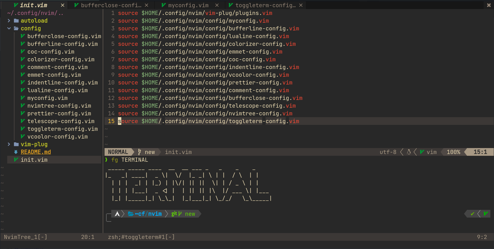

# Neovim Config

<!-- ## Screen*Shot* -->

## Scr



## Requirements

Requires [Node.js](https://nodejs.org/) v17+ to run.

```sh
sudo pacman -S nodejs npm yad ripgrep fzf the_silver_searcher
sudo npm install -g live-server prettier
yay -S fd-git
yay -S ruby-json_pure (optional)
pip install pynvim --upgrade
```

Install [VimPlug](https://github.com/junegunn/vim-plug).
for Neovim:

```sh
sh -c 'curl -fLo "${XDG_DATA_HOME:-$HOME/.local/share}"/nvim/site/autoload/plug.vim --create-dirs \
       https://raw.githubusercontent.com/junegunn/vim-plug/master/plug.vim'
```

## Installation

Remove autoload/plugged/\* (Check first)

```
cd ~/.config
mv nvim nvim-bk
git clone https://github.com/agung-satria/nvim.git
nvim
:PlugInstall
:CocInstall coc-html coc-css coc-json coc-tsserver coc-phpls
```

## Plugins

| Plugin  | README                  |
| ------- | ----------------------- |
| Gruvbox | [morhetz/gruvbox][plgh] |

> Note: Personal config

[plgh]: https://github.com/morhetz/gruvbox
