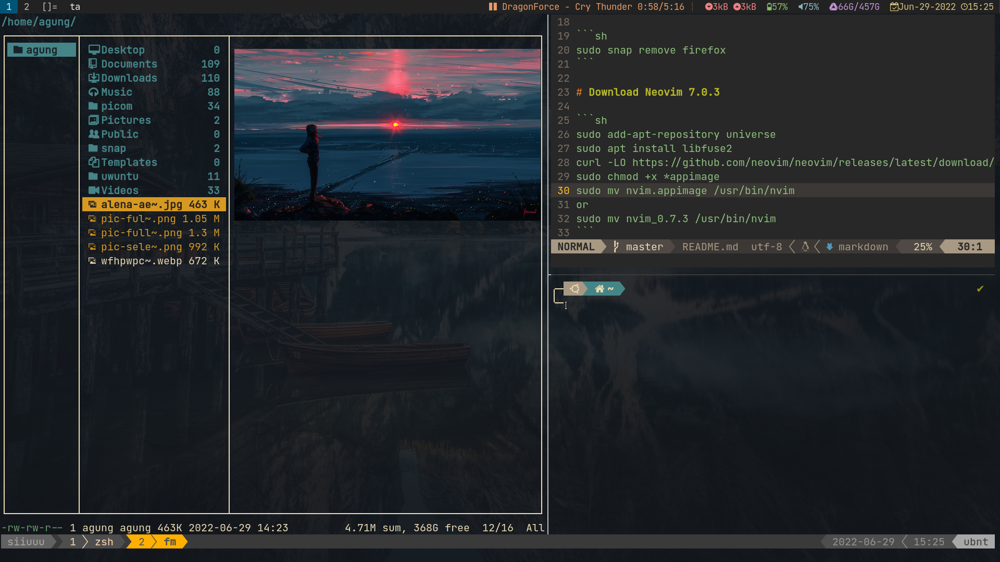

# Scr



# If run DWM

If run DWM from Display Manager, run `asd` (AutoStartDwm)

# Install suckless software

```sh
sudo make install
```

# Enable Tap to Click

```sh
sudo cp /usr/share/X11/xorg.conf.d/40-libinput.conf /etc/X11/xorg.conf.d
sudo nvim /etc/X11/xorg.conf.d/40-libinput.conf
```

Add this section:

```sh
Section "InputClass"
	Identifier "devname"
	Driver "libinput"
	Option "Tapping" "on"
	Option "NaturalScrolling" "true"
EndSection
```

Restart your WM

# Disable Power Button

```
sudo nvim /etc/systemd/logind.conf
```

Set this value
`HandlePowerKey=ignore`
Restart your machine

# Install lockscreen (optional)

```sh
https://github.com/Raymo111/i3lock-color
https://github.com/betterlockscreen/betterlockscreen
```

# Install compositor (optional)

`https://github.com/yshui/picom`

Dependencies:

```sh
sudo apt install libxext-dev libxcb1-dev libxcb-damage0-dev libxcb-xfixes0-dev libxcb-shape0-dev libxcb-render-util0-dev libxcb-render0-dev libxcb-randr0-dev libxcb-composite0-dev libxcb-image0-dev libxcb-present-dev libxcb-xinerama0-dev libxcb-glx0-dev libpixman-1-dev libdbus-1-dev libconfig-dev libgl1-mesa-dev libpcre2-dev libpcre3-dev libevdev-dev uthash-dev libev-dev libx11-xcb-dev meson
git clone https://github.com/yshui/picom.git
cd picom

To Build:
git submodule update --init --recursive
meson --buildtype=release . build
ninja -C build

To Install:
sudo ninja -C build install
```

Built binary can be found in build/src

> That's it! Don't rice too much!
